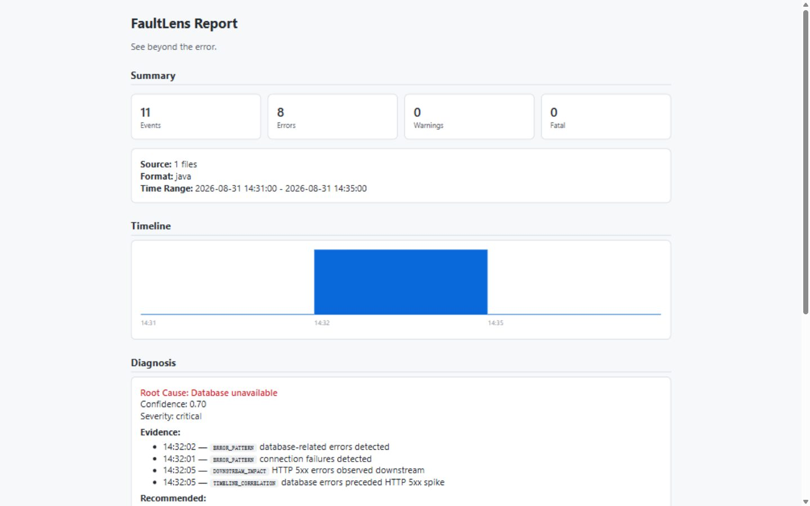

# FaultLens

> **Local-first, explainable log incident diagnosis for developers and CI/CD.**
>
> Turn noisy application logs into structured incidents, evidence-based
> root-cause hypotheses, and actionable recommendations.
>
> **No cloud service. No database. No telemetry. No LLM API.**

**🌐 Language:** [English](README.md) | [简体中文](README.zh-CN.md)

[](LICENSE)
[](https://go.dev/dl/)
[](https://github.com/MangoGreenTeaz/FaultLens/actions/workflows/test.yml)
[](https://github.com/MangoGreenTeaz/FaultLens/releases)
[](https://goreportcard.com/report/github.com/MangoGreenTeaz/FaultLens)
[](CONTRIBUTING.md)

## Table of Contents

- [Demo](#demo)
- [Why FaultLens](#why-faultlens)
- [Features](#features)
- [Quick Start](#quick-start)
- [Installation](#installation)
- [Supported Log Formats](#supported-log-formats)
- [Diagnosis Rules](#diagnosis-rules)
- [Custom Rules](#custom-rules)
- [Multi-file Analysis](#multi-file-analysis)
- [GitHub Actions](#github-actions)
- [HTML Report](#html-report)
- [Diff](#diff)
- [How It Works](#how-it-works)
- [Architecture](#architecture)
- [Examples](#examples)
- [Development](#development)
- [Contributing](#contributing)
- [Security](#security)
- [Roadmap](#roadmap)
- [License](#license)

## Demo

```bash
faultlens examples/basic/app.log
```

```text
FaultLens
────────────────────────────────────────────

Log Summary

Events:       7
Errors:       3
Warnings:     1
Time Range:   10:00:01 - 10:00:07
Format:       java

────────────────────────────────────────────

Top Error Groups

1. connection refused <IP>:<PORT>
   1 occurrences

2. MySQL connection failed
   1 occurrences

3. HTTP 500 Internal Server Error
   1 occurrences

────────────────────────────────────────────

Diagnosis

ROOT CAUSE
Database unavailable

Confidence
0.70

Severity
critical

Evidence
10:00:06  ERROR_PATTERN
database-related errors detected

10:00:04  ERROR_PATTERN
connection failures detected

10:00:07  DOWNSTREAM_IMPACT
HTTP 5xx errors observed downstream

10:00:07  TIMELINE_CORRELATION
database errors preceded HTTP 5xx spike

Recommendations
1. Check MySQL availability
2. Check database connection limit
3. Check recent database restart
4. Check network connectivity between application and database
```

## Why FaultLens

Log files already contain the story of an incident — but they are noisy,
unstructured, and full of duplicated errors. FaultLens turns them into an
explainable diagnosis:

- **Local-first & offline** — everything runs on your machine; nothing leaves it.
- **Explainable** — every diagnosis ships with evidence, a rule, and a
  confidence score traceable to the log lines.
- **Fast** — streaming pipeline; a 500 MiB log processes in minutes with ~2 MB
  resident heap.
- **CI/CD friendly** — stable JSON output and an HTML artifact slot into any
  pipeline.
- **Extensible** — define your own diagnosis rules in YAML, no source changes.

## Features

- 🔍 **9 log format parsers** — plain text, JSON, Java/Spring Boot (stack
  traces merged into one event), Nginx, Apache, Python, Syslog (RFC 3164 +
  5424), Docker JSON, Kubernetes; content-based auto detection.
- 🧹 **Dynamic value normalization** — IPs, ports, UUIDs, numbers, timestamps,
  URLs, paths and hex IDs become stable placeholders; HTTP status codes keep
  their meaning.
- 🗂️ **Error clustering** — identical errors merge by SHA-256 fingerprint,
  ranked by occurrence.
- 📈 **Anomaly detection** — per-minute buckets vs an explainable baseline
  (mean + z-score), no machine learning.
- 🧠 **14 built-in diagnosis rules** — database, redis, OOM, timeouts, HTTP
  5xx, crash, disk full, certificates, MQ, connection pool, network partition,
  CPU saturation, slow queries, deadlocks.
- ⚙️ **Custom rules in YAML** — extend diagnosis without writing Go.
- 📁 **Multi-file analysis** — directories, globs, `--exclude`.
- 🖥️ **Report formats** — terminal, JSON, Markdown, offline HTML with an SVG
  timeline.
- 🔀 **Diff** — compare two analysis runs (before/after deploy).
- 🤖 **GitHub Actions** — analyze logs in CI, publish JSON + HTML artifacts.

## Quick Start

```bash
go install github.com/MangoGreenTeaz/FaultLens/cmd/faultlens@latest

faultlens app.log                # full report
faultlens errors app.log         # error clustering
faultlens timeline app.log       # timeline + anomalies
faultlens incident app.log       # root-cause diagnosis
```

Or pipe logs from stdin:

```bash
cat app.log | faultlens
docker logs some-container | faultlens incident
```

## Installation

**Requirements:** [Go 1.22+](https://go.dev/dl/)

Install the latest release:

```bash
go install github.com/MangoGreenTeaz/FaultLens/cmd/faultlens@latest
```

Pre-built binaries are available on the [Releases](https://github.com/MangoGreenTeaz/FaultLens/releases)
page: Linux, macOS and Windows for amd64 and arm64 (Windows ships a raw `.exe`).

Or build from source:

```bash
git clone https://github.com/MangoGreenTeaz/FaultLens.git
cd FaultLens
go build -o faultlens ./cmd/faultlens
```

Verify:

```bash
faultlens version
```

## Supported Log Formats

| Format | Status | Notes |
| --- | --- | --- |
| Plain text | Stable | `timestamp + level + message` |
| JSON | Stable | JSONL; field aliases (`time`/`ts`, `severity`, `msg`…) |
| Java / Spring Boot | Stable | Multi-line stack traces merged into one event |
| Nginx | Stable | Access + error logs; status/method/path extracted |
| Apache | Stable | Common / combined / vhost-combined |
| Python | Stable | Standard `logging` format (comma-fractional seconds) |
| Syslog | Stable | RFC 3164 + RFC 5424; PRI → severity mapping |
| Docker JSON | Stable | `{"log","stream","time"}` |
| Kubernetes | Stable | Kubelet container logs (`ts stdout F msg`) |

Use `--format auto|plain|json|java|nginx|apache|python|syslog|docker|kubernetes`
to override content-based detection.

## Diagnosis Rules

14 built-in rules, each scoring evidence → confidence:

| Rule ID | Root Cause | Severity | Key Evidence |
| --- | --- | --- | --- |
| `database_unavailable` | Database unavailable | critical | mysql/postgres/sql/jdbc + connection failures + 5xx downstream |
| `redis_unavailable` | Redis unavailable | critical | redis/cache errors + connection failures |
| `out_of_memory` | Out of memory | critical | OOM keywords + stack trace |
| `mq_unavailable` | Message queue unavailable | critical | rabbitmq/amqp/kafka + 5xx downstream |
| `network_partition` | Network partition | critical | network/host unreachable + 5xx downstream |
| `disk_full` | Disk full | critical | no space left on device, write errors |
| `certificate_expired` | Certificate expired | high | x509, ssl handshake failures |
| `connection_pool_exhausted` | Connection pool exhausted | high | pool exhaustion; downgraded when DB is down |
| `cpu_saturation` | CPU saturation | high | cpu usage + timeline trend |
| `deadlock` | Deadlock detected | high | deadlock, lock timeout |
| `application_crash` | Application crash | high | fatal/panic; downgraded when OOM present |
| `http_5xx_spike` | HTTP 5xx spike | high | 5xx (a symptom, never outranks its upstream cause) |
| `connection_timeout` | Connection timeout | medium | read/socket/connect timeouts |
| `slow_query` | Slow query | medium | slow queries (symptom-type) |

## Custom Rules

Extend diagnosis without changing source code — define rules in YAML:

```yaml
custom_rules:
  - id: database_connection_failure
    root_cause: "Database connection failure"
    severity: high
    keywords:
      - connection refused
      - database unavailable
    strong_weight: 0.40
    supporting_keywords:
      - network unreachable
    supporting_weight: 0.20
    enable_downstream: true
    recommendations:
      - "Check database availability"
      - "Check network connectivity"
```

Fields:

| Field | Description |
| --- | --- |
| `id` | Unique rule identifier (must not collide with built-ins) |
| `root_cause` | The diagnosis label shown in reports |
| `severity` | `low` / `medium` / `high` / `critical` |
| `keywords` | Strong-evidence keywords (at least one required) |
| `strong_weight` | Confidence added when strong evidence matches (default 0.40) |
| `supporting_keywords` | Optional supporting-evidence keywords |
| `supporting_weight` | Confidence added for supporting evidence (default 0.20) |
| `enable_downstream` | Add downstream HTTP 5xx + temporal evidence |
| `recommendations` | Read-only, low-risk remediation steps |

Custom rules compete with built-ins through the same evidence-scoring engine.
Manage configuration:

```bash
faultlens config init       # generate .faultlens.yaml
faultlens config show       # print the merged effective config
faultlens config validate   # validate config files
```

Configuration sources, lowest → highest: built-in defaults →
`.faultlens.yaml` (project) → `~/.config/faultlens/config.yaml` (user) →
`--config <file>`.

See [examples/custom-rule](examples/custom-rule/) for a runnable example.

## Multi-file Analysis

Analyze many logs as one incident:

```bash
faultlens logs/                     # recursive directory (*.log, *.jsonl)
faultlens 'logs/**/*.log'           # glob
faultlens app.log database.log nginx.log   # explicit files
faultlens logs/ --exclude '*.debug.log'    # exclude a pattern
```

Events from all files are merged into one timeline, grouping and diagnosis;
each error example keeps its origin file.

## GitHub Actions

Run FaultLens in CI and publish the report as artifacts:

```yaml
name: FaultLens

on:
  workflow_run:
    workflows: ["Tests"]
    types: [completed]

jobs:
  diagnose:
    runs-on: ubuntu-latest
    steps:
      - uses: actions/checkout@v4

      - name: Install FaultLens
        run: go install github.com/MangoGreenTeaz/FaultLens/cmd/faultlens@latest

      - name: Analyze logs
        run: |
          faultlens ./logs/app.log --output json > faultlens.json
          faultlens ./logs/app.log --output html -o faultlens-report.html

      - name: Upload report
        uses: actions/upload-artifact@v4
        with:
          name: faultlens-report
          path: |
            faultlens.json
            faultlens-report.html
```

The repository also ships an official composite action:

```yaml
- uses: ./.github/actions/faultlens
  with:
    log-file: testdata/incidents/mysql-outage.log
    output: html
    output-file: faultlens-report.html
```

| Input | Description | Default |
| --- | --- | --- |
| `log-file` | Path to the log file to analyze | required |
| `output` | Report format: `json`, `html`, `terminal` | `html` |
| `output-file` | Where the report is written | `faultlens-report` |

The composite action runs FaultLens inside GitHub Actions without requiring a
hosted service. A complete runnable workflow is in
[`.github/workflows/ci-analysis.yml`](.github/workflows/ci-analysis.yml).

## HTML Report

Generate a self-contained, offline incident report:

```bash
faultlens app.log --output html -o report.html
```



- **No CDN, no external JavaScript, no backend, no network dependency**
- Inline CSS + an inline SVG error timeline (anomalous buckets highlighted)
- Sections: summary, timeline, error groups, diagnosis, evidence,
  recommendations, source files

Suitable for CI artifacts, incident sharing and postmortems.

## Diff

Compare two analysis runs:

```bash
faultlens incident app.log --output json -o before.json
# ... deploy or change the logs ...
faultlens incident app.log --output json -o after.json
faultlens diff before.json after.json
```

Shows added/removed/changed error groups, diagnosis changes, and confidence
changes — ideal for deploy regressions.

## How It Works

```
input → parser → normalize → grouping → timeline → anomaly → diagnosis → report
```

1. **Parse** raw log lines into a unified `LogEvent` model.
2. **Normalize** dynamic values so `Connection refused 10.0.0.1:3306` and
   `Connection refused 10.0.0.2:3306` become the same shape.
3. **Group** identical errors by fingerprint and count them.
4. **Build** per-minute buckets and **detect** anomalous spikes against an
   explainable baseline.
5. **Diagnose** by scoring every candidate root cause with evidence and
   confidence; symptoms (HTTP 5xx) never beat their upstream cause.
6. **Report** in the format you choose.

## Architecture

```
input (file / stdin / directory / glob)
        ↓
parser (9 formats, content-based auto detection)
        ↓
normalize → grouping (SHA-256 fingerprints)
        ↓
timeline → anomaly (z-score vs baseline)
        ↓
diagnosis (built-in rules + custom rules)
        ↓
terminal / json / markdown / html
```

```
cmd/faultlens/       CLI entry point (Cobra)
internal/engine/     analysis pipeline (input → … → diagnosis)
internal/model/      shared data model (LogEvent, Diagnosis, …)
internal/input/      file & stdin streaming input
internal/parser/     plain / json / java / nginx / apache / python / syslog /
                     docker / kubernetes parsers
internal/normalize/  error normalization
internal/grouping/   error clustering + fingerprints
internal/timeline/   per-minute time buckets
internal/anomaly/    z-score anomaly detection
internal/diagnosis/  root-cause engine + built-in/custom rules
internal/output/     terminal / JSON / Markdown / HTML renderers
internal/config/     configuration load, merge and validation
testdata/            sample logs and incident fixtures
examples/            runnable end-to-end examples
```

Core analysis packages are independent of the CLI, so the pipeline can be
reused by future GitHub Actions or API integrations. See
[docs/architecture.md](docs/architecture.md) for the full design.

## Examples

Every example is runnable and produces its output from the real CLI:

| Example | Shows |
| --- | --- |
| [basic](examples/basic/) | The minimal workflow |
| [database-outage](examples/database-outage/) | Incident chain → Database unavailable |
| [network-partition](examples/network-partition/) | Network root cause |
| [disk-full](examples/disk-full/) | Custom rule for disk exhaustion |
| [custom-rule](examples/custom-rule/) | Defining a custom rule from scratch |
| [ci](examples/ci/) | GitHub Actions workflow |

## Development

```bash
go build ./...
go test ./...
go vet ./...
gofmt -l .
```

## Contributing

Contributions are welcome — parsers, diagnosis rules, fixtures and docs. See
[CONTRIBUTING.md](CONTRIBUTING.md), including **good first contributions**.

## Security

See [SECURITY.md](SECURITY.md) for how to report vulnerabilities.

## Roadmap

V3 ideas are recorded (not implemented) in [plan-v2.md](plan-v2.md):
real-time tail, daemon mode, web UI, rule learning, cross-host timeline
alignment.

## License

FaultLens is released under the [MIT License](LICENSE).

By contributing to FaultLens, you agree that your contributions will be
licensed under the same MIT License.